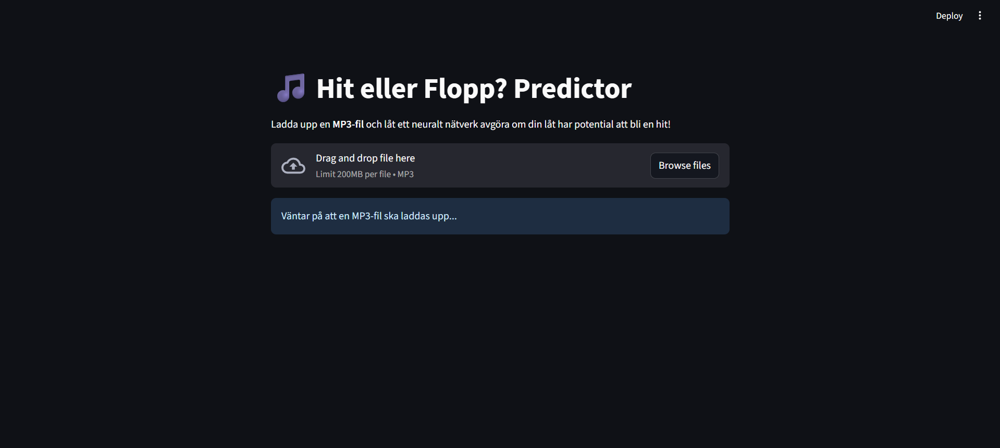
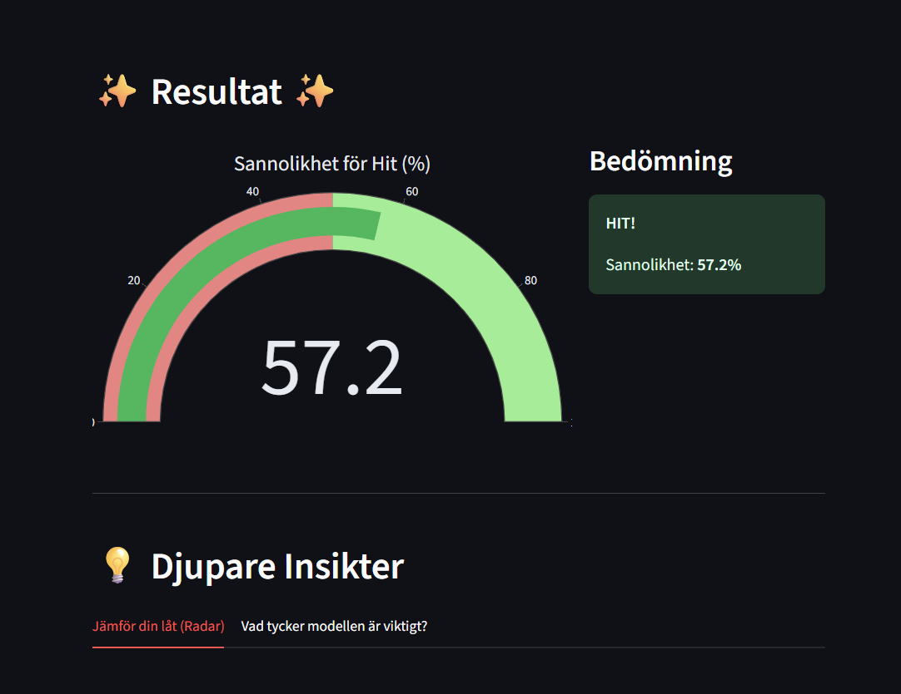
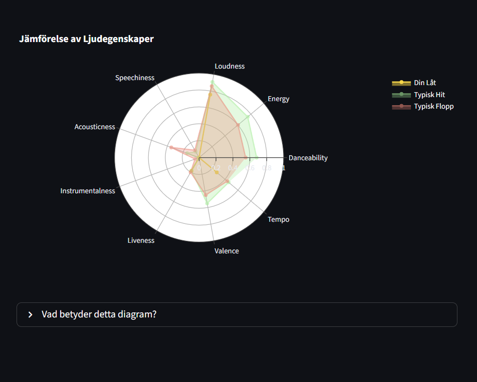

# Spotify Hit Predictor 🎵

This project is a complete machine learning application that predicts whether a song has the potential to become a "hit" based on its audio features. The project covers the entire ML lifecycle: from data analysis and model training to building an interactive web app where users can upload their own MP3 files for analysis.

The idea for this project originated from a conversation with a music-producing colleague, which led to the question: **"Can AI predict a hit song?"**

---

## Application Interface

  
  
  


---

## ✨ Features

- **Deep Learning Model:** Uses a neural network built with TensorFlow/Keras to classify songs as "Hit" or "Flop".
- **Real-time MP3 Analysis:** Upload an MP3 file and get an instant prediction.
- **Audio Feature Extraction:** Leverages the `librosa` library to extract 9 key audio features, such as *Danceability*, *Energy*, and *Tempo*.
- **Interactive Visualization:** Results are presented with gauges, fun animations (balloons/snow), and advanced radar charts comparing your song to the profile of a typical hit/flop.
- **Complete ML Evaluation:** Includes detailed model evaluation with a Confusion Matrix, Classification Report, and AUC-ROC curves.

---

## 🛠️ Technology Stack

- **Backend & Modeling:** Python, TensorFlow, Scikit-learn, Pandas  
- **Audio Analysis:** Librosa  
- **Web Interface:** Streamlit  
- **Visualization:** Plotly, Matplotlib, Seaborn  
- **Data Balancing:** Imbalanced-learn (for the SMOTE experiment)  

---

## 📂 Project Structure


├── spotify_hit_predictor.h5 # The trained model
├── scaler.pkl # The saved StandardScaler object
├── features.pkl # List of feature names
├── app_mp3.py # The Streamlit app for MP3 uploads
├── train_model.py # Script to train and evaluate the model
├── explore_data.py # Script for EDA and unsupervised learning analysis
├── feature_extractor.py # Function to extract audio features
├── Spotify_Youtube.csv # The original dataset
├── requirements.txt # Python dependencies
└── README.md # This file

---

## 🚀 How to Run the Project

### 1. Prerequisites

**Clone the repository:**
```bash
git clone https://github.com/your-username/your-repo-name.git
cd your-repo-name
Download the dataset:
Download the Spotify_Youtube.csv file from Kaggle and place it in the project’s root directory.

Install FFmpeg:
Librosa requires FFmpeg to process MP3 files.

macOS: brew install ffmpeg

Linux: sudo apt-get install ffmpeg

Windows: Download from official site and add it to your system’s PATH.

Install Python dependencies:

bash
Kopiera kod
pip install -r requirements.txt
2. Train the Model
Run the training script to generate the model files (.h5, .pkl) and evaluation charts:

bash
Kopiera kod
python train_model.py
3. Run the Streamlit App
Once the model is trained, start the web app:

bash
Kopiera kod
streamlit run app_mp3.py
Open your browser and navigate to the local URL shown in the terminal.
